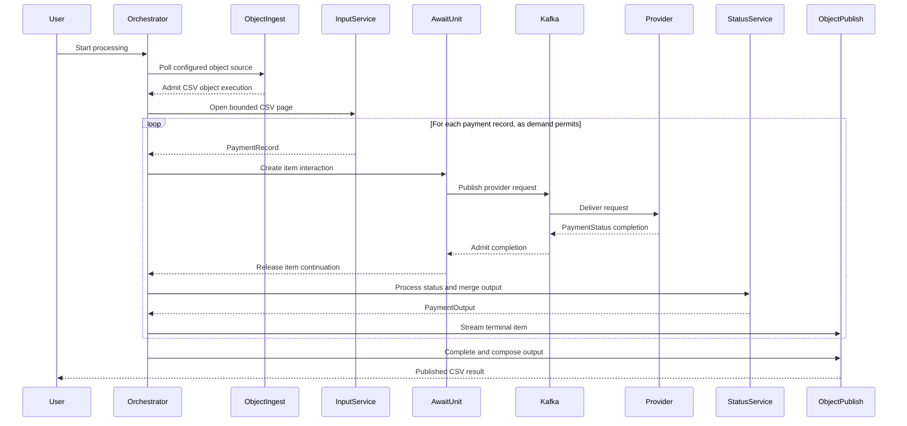

# CSV Kafka Payments

[](https://github.com/The-Pipeline-Framework/csv-kafka-payments/actions/workflows/ci.yml)

Process a CSV file of payments, wait for an asynchronous mock provider to complete each payment,
and write the final results to an output CSV. This Quarkus application uses The Pipeline Framework
(TPF) for typed steps, reactive execution, durable Await completion, persistence and object I/O.

The modular application uses gRPC between step services and Kafka for provider requests and
completions. The self-hosted HA reference also supports SQS. This repository consumes published
TPF artifacts; you do not need a framework source checkout.

- [Getting started](#getting-started)
- [Data flow](#data-flow)
- [Runtime layouts](#runtime-layouts) and [repository structure](#repository-structure)
- [Configuration and local development](#configuration)
- [Testing](#testing)
- [Observability and replay](#observability)
- [Release production](#release-production)
- [Documentation and contributing](#documentation)

## Getting Started

### Prerequisites

- JDK 21, including `java` and `keytool`.
- Docker with Docker Compose for container builds and end-to-end runs.
- Bash, Python 3 and OpenSSL for the self-hosted harness and development certificates.

Use the included Maven wrapper. Run the commands below from the repository root, and keep Maven
artifacts in this checkout's `.m2/repository`.

### Installation

```bash
git clone https://github.com/The-Pipeline-Framework/csv-kafka-payments.git
cd csv-kafka-payments
```

### First complete run

The self-hosted harness builds the application images, starts the infrastructure and services,
submits a CSV, verifies the output and tears down the stack in CI mode. To use Kafka completions:

```bash
TPF_CSV_AWAIT_TRANSPORT=kafka ./self-host/container/run-container-ha-demo.sh --ci
```

For the SQS version, use the harness's default:

```bash
./self-host/container/run-container-ha-demo.sh --ci
```

Both runs use a durable coordinator, a REST transition worker, a grouped pipeline runtime,
PostgreSQL persistence and LocalStack-backed coordinator stores. See the
[self-hosted reference](self-host/container/README.md) for configuration, admission profiles,
output locations and keeping a stack running for inspection.

### Build and unit tests

Build the default modular application without container images:

```bash
./mvnw -B clean package -DskipTests -Dquarkus.container-image.build=false \
  -Dmaven.repo.local="$PWD/.m2/repository"
```

Run the unit-test reactor:

```bash
./mvnw -B test -Dquarkus.container-image.build=false \
  -Dmaven.repo.local="$PWD/.m2/repository"
```

### Why the TPF versions differ

TPF's component repositories publish independently. The BOM identifies a promoted compatible
set; its version does not mean every component has that version. The published 26.10.1-SNAPSHOT
BOM still selects 26.9.4 components, while this application needs the newer paged APIs.
The parent POM therefore selects contracts, compiler and runtime at 26.10.1-SNAPSHOT and keeps
connectors at their published 26.9.4-SNAPSHOT version.

| Component | Why the application selects it |
| --- | --- |
| Contracts | Shared APIs/SPIs used by application code and pulled in transitively by the runtime. Explicit dependency management aligns the whole contracts family, including paged publication, because the imported BOM otherwise overrides those transitive versions. |
| Compiler | Generates adapters and metadata during the build. The runtime does not supply it. It is a `provided` dependency in `common` and explicitly selected on the annotation-processor path. |
| Runtime | Executes the generated application adapters. |
| Connectors | Supply CSV representation and object-ingest boundaries, with their own publication lifecycle. |

Setting a consumer property with the same name as an imported BOM property does not override
that BOM's dependency versions. The separate properties support exact component pins in
cross-repository system tests. Once a promoted BOM contains the required compatible set,
application overrides can be removed in favor of its managed dependency versions.

For other application layouts, see [Runtime layouts](#runtime-layouts). Container and integration
checks are grouped under [Testing](#testing).

## Data Flow

The canonical modular flow is:

1. Object Ingest admits each matching CSV object into a queue-async execution.
2. `Process Csv Payments Input` reads the pinned object in pages of 1,000 logical OpenCSV
   records, preserving quoted multiline and UTF-8 records across checkpoints.
3. This `ONE_TO_MANY` operation has an `await:` modifier. Each emitted `PaymentRecord` becomes
   one trusted provider request and one durable completion interaction.
4. The Kafka adapter publishes requests to `csv-payments.payment.requests`.
5. The external mock provider in `payments-processing-svc` calls `PaymentProviderServiceMock`
   and publishes completions to `csv-payments.payment.results`.
6. TPF admits completions idempotently. A live owner continues downstream as demand permits;
   durable fallback resumes the execution after the Await unit completes and reconstructs
   ordered `PaymentStatus` variants.
7. Approved and unapproved status steps handle the provider outcomes. `Finalize Payment Output`
   merges their branches into the terminal `PaymentOutput`.
8. Object Publish streams those outputs into grouped CSV files.

Kafka delivery is at-least-once. TPF admits completions idempotently and reconstructs an ordered
Await unit when the owning execution resumes.

The application persists pre-Await and post-Await service outputs. Resume is at-least-once from
the Await boundary onward, so persisted entities use stable business IDs and
`persistence.duplicate-key=ignore`. Duplicate redelivery becomes a no-op.



### Expected CSV Output Columns

The output columns are `AMOUNT`, `CSV ID`, `CURRENCY`, `FEE`, `MESSAGE`, `RECIPIENT`,
`REFERENCE` and `STATUS`. Sample inputs are in
[input-csv-file-processing-svc/csv](input-csv-file-processing-svc/csv).

### Object I/O Backpressure

One source object becomes one user-visible queue-async execution. The coordinator opens one
bounded page at a time, the parser emits rows on downstream demand, and an active Await session
hands completions to the live continuation. Object Publish streams attempt-safe page parts, then
composes them in page order into one output object after source exhaustion.

The page bound counts logical records, including blank or rejected records, but excludes the
header. OpenCSV checkpoints pin file identity, size and modification time; a mismatch fails
deterministically. Failure or cancellation reopens the same page start. Completed pages are
not reread.

The current path uses reactive demand and the Await in-flight window. `BlockingIteratorPacer`
remains a blocking-thread throttle for the deprecated file-step path. Shape the demo with provider
concurrency/retry settings and the object I/O connector's admission/write settings.

## Runtime Layouts

Runtime layout describes where the pipeline runs; build topology describes its Maven modules,
JARs and containers. gRPC and LOCAL are step transport modes. Kafka and SQS carry external
provider requests and completions independently of that choice.

| Layout | Shape | Build entry point |
| --- | --- | --- |
| Modular | Separate orchestrator, input, status, provider and persistence hosts | Root Maven reactor; telemetry image helpers below |
| Pipeline runtime | Grouped pipeline execution with separate orchestration and persistence | `build-pipeline-runtime.sh` |
| Monolith | Pipeline execution in one runnable application with generated LOCAL clients | `build-monolith.sh` |

```bash
./build-pipeline-runtime.sh -DskipTests -Dquarkus.container-image.build=false \
  -Dmaven.repo.local="$PWD/.m2/repository"
./build-monolith.sh -DskipTests -Dquarkus.container-image.build=false \
  -Dmaven.repo.local="$PWD/.m2/repository"
```

The layout helpers apply their runtime mapping during the build and restore the previous
configuration afterwards. The monolith helper first generates LOCAL clients through the
orchestrator module. Its `tpf.build.transport=LOCAL` switch controls generation; the packaged
monolith already contains the required clients. Monolith E2E tests live in `orchestrator-svc`
and launch the application from `monolith-svc`.

The modular image helpers select the strict modular mapping:

| Helper | Purpose |
| --- | --- |
| `build-modular-telemetry-images.sh` | Replay-enabled modular E2E and provider-rejection captures |
| `build-modular-observability-images.sh` | Live metrics and tracing verification against LGTM |

## Repository Structure

| Path | Responsibility |
| --- | --- |
| [config](config) | Canonical pipeline, IDL lock and runtime mappings |
| [common](common/README.md) | Shared representations, mappers and generated protobuf contracts |
| [input-csv-file-processing-svc](input-csv-file-processing-svc/README.md) | Paged CSV parsing and the authored provider-request operation |
| [payments-processing-svc](payments-processing-svc/README.md) | External mock provider for brokered completions |
| [payment-status-svc](payment-status-svc/README.md) | Approved/unapproved status handling and terminal output merge |
| [persistence-svc](persistence-svc) | Persistence host |
| [orchestrator-svc](orchestrator-svc/README.md) | Orchestration, end-to-end tests, replay and dashboard resources |
| [pipeline-runtime-svc](pipeline-runtime-svc) | Grouped pipeline runtime |
| [monolith-svc](monolith-svc) | Single-process pipeline application |
| [self-host/container](self-host/container/README.md) | HA container harness and operational proofs |
| [terraform](terraform) | Infrastructure configuration |

The application uses Quarkus, Mutiny, gRPC, Kafka, OpenCSV, MapStruct and Lombok. Tests use
JUnit 5, Mockito and Testcontainers. Protobufs are generated from `config/pipeline.yaml` during
`generate-sources` and placed in `common/target/generated-sources/proto`.

## Configuration

Use the canonical configuration and each host's properties rather than copying settings between
layouts. The self-hosted Compose stack has its own ports and deployment overrides.

| Configuration | Purpose |
| --- | --- |
| [config/pipeline.yaml](config/pipeline.yaml) | Types, steps, paging, Await transport and persistence aspects |
| `config/pipeline.runtime.yaml` | Active runtime placement, applied by the layout helpers |
| [config/runtime-mapping](config/runtime-mapping) | Modular, grouped and monolith mappings |
| [orchestrator properties](orchestrator-svc/src/main/resources/application.properties) | Admission, retry, concurrency, clients and telemetry |
| [provider properties](payments-processing-svc/src/main/resources/application.properties) | Kafka/SQS provider and simulated outcomes |
| [persistence properties](persistence-svc/src/main/resources/application.properties) | Database and duplicate-key handling |
| [self-hosted reference](self-host/container/README.md) | Container settings, ports and durable stores |

The queue-async orchestrator requires a stable resume-token secret:

```properties
pipeline.orchestrator.mode=QUEUE_ASYNC
pipeline.orchestrator.resume-token-secret=${PIPELINE_ORCHESTRATOR_RESUME_TOKEN_SECRET}
```

The modular Kafka topics default to `csv-payments.payment.requests` and
`csv-payments.payment.results`. Keep the secret stable across retries and host restarts.

### Mock Payment Provider Simulation

Provider throttling is controlled by `csv-payments.payment-provider.permits-per-second` and
`csv-payments.payment-provider.timeout-millis`. These additional probabilities range from
`0.0` to `1.0`:

- `csv-payments.payment-provider.provider-timeout-probability`
- `csv-payments.payment-provider.provider-reject-probability`

The mock derives outcomes deterministically from stable payment identifiers. Rejected payments
follow the unapproved `PaymentStatus` branch and still produce normal output rows; technical
timeouts enter the retry path. Malformed CSV input currently fails at file scope.

The explicit terminal step `Finalize Payment Output` merges the approved and unapproved branches
before Object Publish writes their shared `PaymentOutput` representation. The sink does not
perform that branch merge itself.

### Port Configuration

These are the modular services' default HTTPS ports. Consult the
[self-hosted port table](self-host/container/README.md#local-defaults) for Compose runs.

| Host | HTTPS port |
| --- | --- |
| Orchestrator | 8443 |
| Input processing | 8444 |
| Mock provider | 8445 |
| Payment status | 8446 |
| Persistence | 8448 |

### Running the Application

For IDE development, use Quarkus development mode and the [IDE configuration](ide-config).
For manual packaged starts, first build the modular application and configure Kafka, PostgreSQL,
service endpoints and development certificates. Start the long-running hosts in separate terminals,
then run the orchestrator:

```bash
java --enable-preview -jar persistence-svc/target/quarkus-app/quarkus-run.jar
java --enable-preview -jar input-csv-file-processing-svc/target/quarkus-app/quarkus-run.jar
java --enable-preview -jar payments-processing-svc/target/quarkus-app/quarkus-run.jar
java --enable-preview -jar payment-status-svc/target/quarkus-app/quarkus-run.jar
java --enable-preview -jar orchestrator-svc/target/quarkus-app/quarkus-run.jar --ingest-once
```

The automated harness in [Getting started](#getting-started) handles these prerequisites for a
complete container run. See the [orchestrator README](orchestrator-svc/README.md) for entry options.

<details>
<summary>Native builds</summary>

The native CI workflow builds the four runnable services independently. To
build the same executables locally with Docker available:

```bash
for service in orchestrator-svc input-csv-file-processing-svc payments-processing-svc payment-status-svc; do
  native_args=--enable-preview
  if [ "$service" = input-csv-file-processing-svc ]; then
    native_args=--enable-preview,--initialize-at-run-time=org.apache.commons.logging.impl.Log4jApiLogFactory
  fi
  ./mvnw -B -f pom.xml -pl "$service" -am -DskipTests \
    -Dquarkus.container-image.build=false -Dquarkus.native.enabled=true \
    -Dquarkus.native.container-build=true \
    "-Dquarkus.native.additional-build-args=$native_args" \
    -Dmaven.repo.local="$PWD/.m2/repository" package
done

# With the required infrastructure and persistence host already running,
# start each service in a separate terminal
./input-csv-file-processing-svc/target/*-runner
./payments-processing-svc/target/*-runner
./payment-status-svc/target/*-runner

# Run the orchestrator-svc as a CLI application (after all services are up)
./orchestrator-svc/target/*-runner --ingest-once

# Note: You'll need to stop each service manually in each terminal
```

</details>

### SSL Certificate Handling in Development

The build generates development certificates under `target/dev-certs`. To regenerate them:

```bash
./generate-dev-certs.sh
```

<details>
<summary>Trusting a development certificate on macOS</summary>

With the input service running, export its certificate and add it to your user keychain:

```bash
echo | openssl s_client -connect localhost:8444 2>/dev/null | openssl x509 > /tmp/quarkus-cert.pem
security add-trusted-cert -d -r trustRoot -k ~/Library/Keychains/login.keychain-db /tmp/quarkus-cert.pem
```

Restart the browser after adding trust. If the browser reports a common-name error, check the
certificate's Subject Alternative Names. Stop services before regenerating certificates and
restart them afterwards. These certificates are for local development.

</details>

## Testing

The unit-test command is in [Getting started](#build-and-unit-tests). For coverage:

```bash
./mvnw clean test jacoco:report -Dquarkus.container-image.build=false \
  -Dmaven.repo.local="$PWD/.m2/repository"
```

### Running End-to-End Tests

A modular run starts the required infrastructure and hosts, waits for readiness, processes a CSV
and verifies its output. Build the replay-capable images before running the test:

```bash
./build-modular-telemetry-images.sh
./mvnw -f pom.xml -pl orchestrator-svc -am \
  -Dcsv.e2e.prebuilt.modular.images=true \
  -Dcsv.e2e.telemetry.enabled=true \
  -Dcsv.e2e.input.file=input-csv-file-processing-svc/csv/payments_12.csv \
  -Dit.test=CsvPaymentsEndToEndIT#fullPipelineWorks \
  verify -Dmaven.repo.local="$PWD/.m2/repository"
```

For durable coordinator/worker coverage, run the [self-hosted harness](#first-complete-run).
[Live export proofs](#tempo--lgtm-verification) and [replay captures](#replay-viewer) are separate
checks, with their own recipes below.

### Runtime-mapping matrix

```bash
MAVEN_ARGS="-Dmaven.repo.local=$PWD/.m2/repository" ./run-runtime-mapping-matrix.sh
MAVEN_ARGS="-Dmaven.repo.local=$PWD/.m2/repository" ./run-runtime-mapping-matrix.sh --with-e2e
```

The matrix swaps `config/pipeline.runtime.yaml` for `modular-auto`, `modular-strict` and
`pipeline-runtime`, then restores it. It validates mapping/build and functional behaviour;
it does not assert deployment topology. Monolith has its own build and E2E lane.

### CI safety lanes

The repository owns its deployment and observability checks in
`.github/workflows/e2e-safety.yml`. Pull requests targeting `main`, pushes to
`main`, and the weekday 04:00 UTC schedule run four independent jobs:

| Lane | Proof |
| --- | --- |
| Monolith | Builds the single-process image and runs the CSV happy-path E2E. |
| Pipeline runtime and persistence | Builds the grouped pipeline runtime and separate persistence service, checks the topology and persistence configuration, then runs the E2E that verifies output rows and database persistence. |
| Provider rejection | Builds telemetry-enabled modular images and checks deterministic rejected and approved output rows and replay capture. |
| Tempo | Builds observability-enabled modular images and checks that traces and metrics reach LGTM/Tempo. |

`.github/workflows/native-builds.yml` builds native executables for the
orchestrator, CSV input, payment processing, and payment status services on
`main`, on the Sunday 05:00 UTC schedule, and by manual dispatch. It is not a
pull-request gate because each native compilation is substantially more
expensive than the JVM E2E jobs. Both workflows resolve released TPF artifacts
into this repository's `.m2/repository`; neither checks out framework sources.
The ordinary `ci.yml` job runs the Maven unit-test reactor, including the CSV
telemetry dashboard contract, on pull requests, `main`, and manual dispatch.
The self-hosted HA workflow runs on pull requests and manual dispatch; the HA
scale workflow runs on `main`, weekdays at 03:00 UTC, and manual dispatch.
HA and scale failures are separate from the application layout and
observability jobs above.

## Observability

Choose the surface that answers your question:

| Surface | Purpose | Entry point |
| --- | --- | --- |
| Grafana metrics and Tempo traces | Live operational aggregates, service topology and asynchronous continuity | Modular LGTM proof below |
| Replay viewer | Offline semantic playback with item and interaction details | Replay capture below |
| Split-host export proof | Positive metrics and spans from coordinator, worker and runtime over SQS and Kafka | `scripts/system-test-suite.sh observability` |

Framework instrumentation, build-time signal capability and deployment exporter configuration
all matter. Enabling a runtime policy cannot add a capability excluded from the binary.
Verify delivery through exporter logs and backend data.

Ordinary self-hosted HA runs keep telemetry disabled by default. The opt-in proof enables it and
also checks that disabling only the worker SDK is detected even when payment processing succeeds:

```bash
bash scripts/system-test-suite.sh observability
```

### Dashboards

The LGTM stack provisions two dashboards from the orchestrator's
[META-INF/grafana resources](orchestrator-svc/src/main/resources/META-INF/grafana):

- `grafana-dashboard-csv-payments.json`: the eight-stage journey, step flow, pressure, Await,
  object I/O, SLO and JVM panels.
- `grafana-dashboard-csv-payments-tempo.json`: TraceQL journey and continuity panels, including
  rootless/unlinked Await diagnostics.

The [CSV telemetry contract](orchestrator-svc/src/test/java/org/pipelineframework/csv/orchestrator/service/CsvPaymentsTelemetryDashboardContractTest.java)
checks the dashboard's metric queries.

### Tempo / LGTM Verification

Build observability-capable modular images, then run the dedicated backend proof:

```bash
./build-modular-observability-images.sh
./mvnw -f pom.xml -pl orchestrator-svc -am \
  -Dcsv.e2e.tempo.enabled=true \
  -Dcsv.e2e.input.file=input-csv-file-processing-svc/csv/payments_12.csv \
  -Dit.test=CsvPaymentsTempoVerificationEndToEndIT \
  verify -Dmaven.repo.local="$PWD/.m2/repository"
```

The test starts LGTM, provisions the dashboards and queries Tempo directly to prove trace delivery
and continuity. Traces reach Tempo through OTLP; Prometheus scrape cadence affects metrics panels.

<details>
<summary>10k operator-dashboard proof</summary>

Use the opt-in 10k proof when validating the operator dashboard under enough work to populate
throughput, latency, pressure, Await, and publication panels:

```bash
./build-modular-observability-images.sh
./mvnw -f pom.xml -pl orchestrator-svc -am \
  -Dcsv.e2e.tempo.enabled=true \
  -Dcsv.e2e.operator-dashboard.10k.enabled=true \
  -Dcsv.e2e.pipeline.wait.seconds=1800 \
  -Dcsv.e2e.input.file=input-csv-file-processing-svc/csv/payments_10k.csv \
  -Dit.test=CsvPaymentsOperatorDashboard10kEndToEndIT \
  verify -Dmaven.repo.local="$PWD/.m2/repository"
```

It submits the single `payments_10k.csv` source without pre-splitting it. The configured `paging.maxRecords: 1000` bounds source replay and transition ownership while each page remains demand-driven. The proof provisions the Grafana metrics and Tempo dashboards, verifies their marked current-series queries against Grafana's Prometheus datasource, checks exactly 10,000 stable outputs, and rejects unlinked Await completion traces. It reports observed latency and pressure but intentionally does not enforce a performance budget. The journey covers page progression, pipeline run, transition dispatch, Await interaction creation, provider dispatch, completion admission, live handoff, scalar continuation, page-part publication, and final-object composition.

</details>

<details>
<summary>Pause a live proof for manual inspection</summary>

```bash
./mvnw -f pom.xml -pl orchestrator-svc -am \
  -Dcsv.e2e.tempo.enabled=true \
  -Dcsv.e2e.tempo.pause.before.teardown=true \
  -Dcsv.e2e.input.file=input-csv-file-processing-svc/csv/payments_12.csv \
  -Dit.test=CsvPaymentsTempoVerificationEndToEndIT \
  verify -Dmaven.repo.local="$PWD/.m2/repository"
```

The harness logs the Grafana UI URL and Tempo API URL before pausing. Grafana uses a dynamically
mapped local port, so open the URL printed by the test rather than assuming `localhost:3000`. Use
that mode for manual inspection only; the CI proof comes from the Tempo API assertion.

</details>

### Performance Expectations

Full-run duration includes provider processing delay and cold-path costs for Quarkus, gRPC,
Kafka, persistence, telemetry export and provider warmup, as well as rate limiting. Parser pace
comes from reactive demand and the Await in-flight window. Dispatch above provider capacity
shows up as pending interactions, broker lag, retries, timeouts or DLQ events.

For performance comparisons, measure these components separately:

1. cold first-item latency,
2. warm first-item latency,
3. steady-state provider permits/sec and provider processing delay,
4. completion-to-continuation latency,
5. terminal Object Publish close latency.

Only compare full-run wall time after those components are visible in metrics, traces, or replay.

### Running with Observability

Quarkus LGTM Dev Services and Prometheus export are opt-in during development:

```bash
export QUARKUS_OBSERVABILITY_LGTM_ENABLED=true
export QUARKUS_MICROMETER_EXPORT_PROMETHEUS_ENABLED=true
```

Enable the desired framework policies in the host configuration as well:

```properties
pipeline.telemetry.enabled=true
pipeline.telemetry.metrics.enabled=true
pipeline.telemetry.tracing.enabled=true
```

These settings require a telemetry-capable build. For packaged proof runs, use the image helpers
and tests above. The harness rebuilds a missing or stale packaged orchestrator before launch.

### Connector-First Metrics

A healthy run admits the expected objects, accepts provider completions, advances downstream
status processing and publishes the expected terminal item count. Object Publish failures and
Await dropped completions stay zero outside intentional duplicate/retry checks. Early-held
completions and resume releases describe durable fallback.

<details>
<summary>Metric names for admission, Await and publication</summary>

- `tpf.object_ingest.listed.objects.total`
- `tpf.object_ingest.submitted.total`
- `tpf.object_ingest.duplicate.total`
- `tpf.object_ingest.failed.total`
- `tpf.await.interaction.dispatched.total`
- `tpf.await.unit.dispatch_complete.total`
- `tpf.await.completion.admitted.total`
- `tpf.await.item.completed.total`
- `tpf.await.completion.early_held.total`
- `tpf.await.resume.released.total`
- `tpf.await.unit.terminal.total`
- `tpf.await.completion.dropped.total`
- `tpf.object_publish.grouped.items.total`
- `tpf.object_publish.grouped.groups.total`
- `tpf.object_publish.published.total`
- `tpf.object_publish.published.bytes.total`
- `tpf.object_publish.skipped.total`
- `tpf.object_publish.failed.total`
- `tpf.object_publish.write.duration`

Object keys, await unit ids, interaction ids, and execution ids are intentionally visible in replay and traces, not metric labels.

</details>

When Prometheus export is enabled, hosts expose `/q/metrics` on their configured HTTP/HTTPS
interface. Use the [port table](#port-configuration) or the active Compose mappings instead of
assuming ports are shared between layouts.

### Replay Viewer

Capture replay JSON from the modular telemetry images:

```bash
./build-modular-telemetry-images.sh
./mvnw -f pom.xml -pl orchestrator-svc -am \
  -Dcsv.e2e.telemetry.enabled=true \
  -Dit.test=CsvPaymentsEndToEndIT#fullPipelineWorks \
  verify -Dmaven.repo.local="$PWD/.m2/repository"
```

The merged artifact is `orchestrator-svc/target/test-e2e/replay/csv-payments-replay.json`.
Open the supported [replay viewer](https://pipelineframework.org/replay-viewer/) and select
**CSV Payments built-in**, or choose **Custom replay** and load your generated JSON.

The built-in dataset comes from the 1k capture and retains a deterministic 907/93 approved/unapproved
split. Keep `provider-reject-probability=0.08` when refreshing it. Copy each capture to a separate
local filename before running another profile.

<details>
<summary>Replay capture profiles: 1k, provider close-up and rejection</summary>

Build the modular telemetry images before recording a profile:

```bash
./build-modular-telemetry-images.sh
```

Capture the 1k input with the built-in dataset's rejection probability:

```bash
./mvnw -f pom.xml -pl orchestrator-svc -am \
  -Dcsv.e2e.telemetry.enabled=true \
  -Dquarkus.otel.traces.sampler.arg=1 \
  -Dcsv.e2e.input.file=input-csv-file-processing-svc/csv/payments_1k.csv \
  -Dcsv-payments.payment-provider.provider-reject-probability=0.08 \
  -Dcsv.e2e.pipeline.wait.seconds=1800 \
  -Dcsv.e2e.orchestrator.wait.seconds=1800 \
  -Dit.test=CsvPaymentsEndToEndIT#fullPipelineWorks \
  verify -Dmaven.repo.local="$PWD/.m2/repository"
```

Baseline typed runtime flow:

```bash
./mvnw -f pom.xml -pl orchestrator-svc -am \
  -Dcsv.e2e.telemetry.enabled=true \
  -Dcsv.e2e.input.file=input-csv-file-processing-svc/csv/payments_1k.csv \
  -Dcsv-payments.payment-provider.permits-per-second=250 \
  -Dcsv-payments.payment-provider.timeout-millis=5000 \
  -Dtest=CsvPaymentsEndToEndIT#fullPipelineWorks \
  -Dsurefire.failIfNoSpecifiedTests=false \
  test -Dmaven.repo.local="$PWD/.m2/repository"
```

Await/Kafka/provider close-up:

```bash
./mvnw -f pom.xml -pl orchestrator-svc -am \
  -Dcsv.e2e.telemetry.enabled=true \
  -Dcsv.e2e.input.file=input-csv-file-processing-svc/csv/payments_12.csv \
  -Dcsv-payments.payment-provider.permits-per-second=25 \
  -Dcsv-payments.payment-provider.timeout-millis=5000 \
  -Dtest=CsvPaymentsEndToEndIT#fullPipelineWorks \
  -Dsurefire.failIfNoSpecifiedTests=false \
  test -Dmaven.repo.local="$PWD/.m2/repository"
```

Provider-reject failure handling:

```bash
./mvnw -f pom.xml -pl orchestrator-svc -am \
  -Dcsv.e2e.telemetry.enabled=true \
  -Dcsv.e2e.telemetry.happy-path-only=false \
  -Dcsv.e2e.input.file=input-csv-file-processing-svc/csv/payments_1k.csv \
  -Dcsv-payments.payment-provider.provider-reject-probability=0.08 \
  -Dtest=CsvPaymentsProviderRejectEndToEndIT \
  -Dsurefire.failIfNoSpecifiedTests=false \
  test -Dmaven.repo.local="$PWD/.m2/repository"
```

Each profile writes the merged replay artifact to:

- `orchestrator-svc/target/test-e2e/replay/csv-payments-replay.json`

Copy that file to a scenario-specific local capture name before running the next profile.

</details>

## Release Production

Release descriptors pin the complete application archives and compiled metadata. Kafka,
PostgreSQL and other external services remain deployment prerequisites. The TPF CLI verifies
or deploys an existing Release using external resolver and deployment configuration.
Install the [TPF CLI](https://pipelineframework.org/deploy/deployment-cli) for the `tpf` commands below.

### Produce a monolith Release

The monolith build can produce a closed application Release: one ZIP contains the complete Quarkus fast-JAR,
its runtime dependencies and compiler-produced `META-INF/pipeline/` metadata. Ordinary verification skips release
production. Enable it explicitly and supply an immutable Release version:

```sh
./build-monolith.sh -Dquarkus.container-image.build=false \
  -Dtpf.release.skip=false -Dtpf.release.version=local-1 -Dtpf.release.allowLocalUris=true \
  -Dmaven.repo.local="$PWD/.m2/repository"
tpf release verify --release monolith-svc/target/pipeline-release.json
```

The descriptor is `monolith-svc/target/pipeline-release.json`; its ZIP is
`monolith-svc/target/pipeline-release-artifacts/monolith-svc.zip`. Local `file:` URIs are not promotable.
Kafka, PostgreSQL and other external services remain deployment prerequisites.

Keep the descriptor and ZIP together. If a rebuild changes the packaged bytes, choose a new Release version;
the producer rejects replacement of an existing immutable Release identity.

<details>
<summary>Publish a promotable monolith Release to Maven</summary>

For a promotable Maven Release, first give the application reactor a non-SNAPSHOT version, for example `1.0.0`.
Configure your standard Maven artefact repository and credentials, and publish the parent POM before the module build:

```sh
./mvnw -N deploy -Dmaven.deploy.skip=false -Dmaven.repo.local="$PWD/.m2/repository"
./build-monolith.sh --deploy -Dquarkus.container-image.build=false -Dmaven.deploy.skip=false \
  -Dtpf.release.skip=false -Dtpf.release.version=1.0.0 \
  -Dtpf.release.artifactUri=maven:org.pipelineframework.csv:monolith-svc:zip:application:1.0.0 \
  -Dmaven.repo.local="$PWD/.m2/repository"
```

The ZIP is attached with classifier `application`. `--deploy` runs standard Maven `deploy` instead of `install` while
keeping the monolith mapping active. Descriptor generation stays in `verify`, before publication; Maven selects no
Cloud target. Preserve the descriptor unchanged alongside the exact published ZIP. The CLI verifies or deploys it
using external resolver and deployment configuration.
The monolith and modular layouts have separate descriptors. The pipeline-runtime layout still needs its own grouped-runtime closure.
See [Release production](https://pipelineframework.org/deploy/release-descriptors) and
[CLI deployment](https://pipelineframework.org/deploy/deployment-cli).

</details>

### Produce a modular Release

The modular Release contains five complete fast-JAR ZIPs: input processing, payment status, the external payment-provider
simulator, persistence, and the orchestrator. Input processing owns `ProcessCsvPaymentsInput`; payment status owns the
approved, unapproved, and final-output steps. The orchestrator carries the complete compiled metadata. The provider
and persistence hosts are included even though they own no authored Pipeline steps. Kafka and PostgreSQL remain
external deployment prerequisites.

Build the modular images, then produce the Release from those packages:

```sh
./build-modular-telemetry-images.sh
./mvnw -B -pl orchestrator-svc \
  org.pipelineframework:pipelineframework-release-maven-plugin:generate-release-descriptor@produce-modular-release \
  org.codehaus.mojo:build-helper-maven-plugin:attach-artifact@attach-modular-release-archives \
  -Dtpf.release.skip=false -Dtpf.release.version=local-modular-1 -Dtpf.release.allowLocalUris=true \
  -Dmaven.repo.local="$PWD/.m2/repository"
python3 scripts/check-release-artifacts.py orchestrator-svc
tpf release verify --release orchestrator-svc/target/pipeline-release.json
```

Preserve `orchestrator-svc/target/pipeline-release.json` and every ZIP under
`orchestrator-svc/target/pipeline-release-artifacts/`. Each archive is attached to the orchestrator Maven artefact with
its host name as classifier. For standard Maven publication, use a non-SNAPSHOT reactor version and configure all five
`tpf.release.<host-name>.uri` properties to immutable Maven locations, such as
`maven:org.pipelineframework.csv:orchestrator-svc:zip:input-csv-file-processing-svc:1.0.0`. Keep the modular mapping active
and run standard Maven `deploy` with `-Dtpf.release.skip=false -Dtpf.release.version=1.0.0 -Dmaven.deploy.skip=false` and
the repository-local Maven cache. The producer is bound to `verify`; Maven does not select a deployment target.

CI produces and verifies this complete Release after both modular E2E builds: provider rejection and Tempo.
It checks every packaged file against the build output and verifies that each authored step is owned exactly once.

## Documentation

- [The Pipeline Framework documentation](https://pipelineframework.org/): framework concepts,
  authoring, deployment and operations.
- [Self-hosted HA reference](self-host/container/README.md): local stack, durable coordinator,
  admission profiles and split-host observability.
- [Orchestrator service](orchestrator-svc/README.md): application entry points and E2E harness.
- [Release production](https://pipelineframework.org/deploy/release-descriptors) and
  [CLI deployment](https://pipelineframework.org/deploy/deployment-cli): immutable application delivery.

Framework documentation lives in the
[pipelineframework repository](https://github.com/The-Pipeline-Framework/pipelineframework/tree/main/docs).
This repository owns the application and its service READMEs.

## Contributing

Create a branch or fork, make the change, run the relevant checks and open a pull request.
[AGENTS.md](AGENTS.md) describes application ownership, the isolated Maven cache and cross-repository
compatibility validation. Changes to TPF semantics belong in their owning framework repositories.

## License

[Apache License 2.0](LICENSE).
