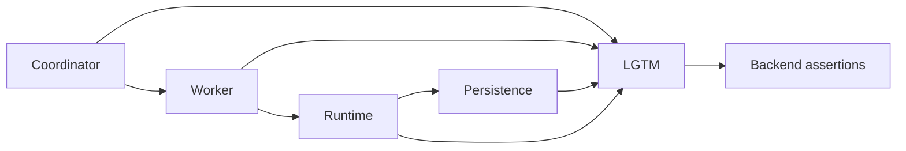

# Self-host telemetry proof

Run `bash scripts/system-test-suite.sh observability` from the application repository.
The suite builds the canonical reactor with OpenTelemetry metrics and tracing enabled,
then runs twelve payments over SQS and Kafka in the existing coordinator/worker/runtime
layout. It uses an isolated Compose project and local LGTM backend, and removes its
containers and volumes on completion.

The proof queries backend data rather than inferring delivery from configuration:

- framework spans and positive framework metrics must appear from the coordinator,
  worker, runtime and persistence host;
- admitted Await completion spans must have a parent or durable origin link;
- metric samples must not contain execution, unit, interaction or correlation labels;
- a fresh run with the worker SDK deliberately disabled must fail the export proof
  specifically because worker telemetry is absent.

Evidence is saved under `target/telemetry-proof/`. Use the component compatibility-set
workflow to verify a runtime change against its immutable candidate artifacts. A local
run over the application's configured artifacts proves the deployment configuration;
it is not evidence for a different unpublished runtime build.

The ordinary HA stack retains its previous telemetry defaults. The observability suite
opts in through `TPF_CSV_OBSERVABILITY=true`, explicit build signal settings and matching
runtime SDK/exporter settings. It does not select another Maven reactor or profile.

Required free ports include the existing self-host application ports, Tempo 3200 and
Prometheus 9090. Override the application ports as in the HA runner; use `TPF_TEMPO_PORT`
and `TPF_PROMETHEUS_PORT` for the backend ports.
